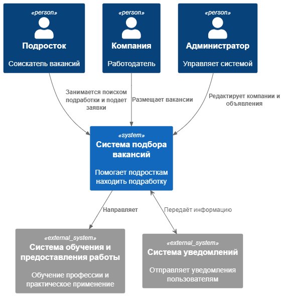
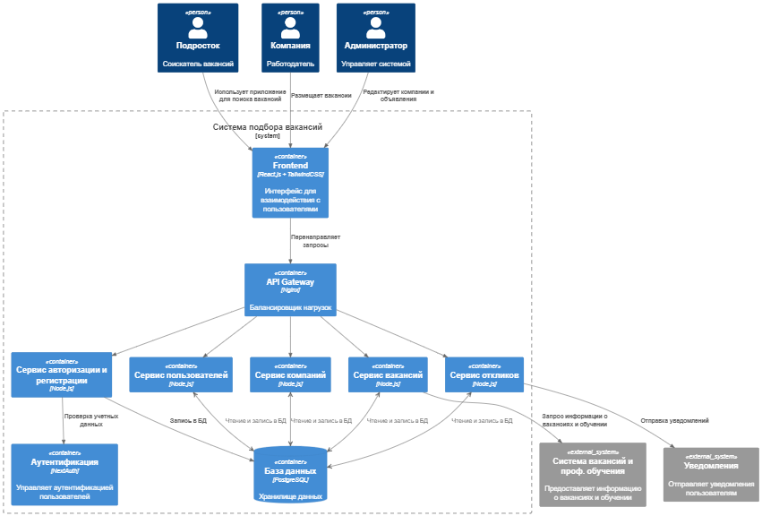
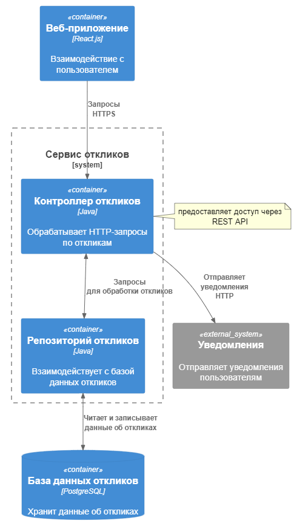

## Диаграмма контекста

## Диаграмма контейнеров (архитектура)
Была выбрана **архитектура микросервисов** с использованием контейнеров, которая предполагает независимое развертывание компонентов системы, более высокую устойчивость к сбоям (при падениее 1 микросервиса остальная часть системы продолжает работать), а также выбранная архитектура упрощяет внедрение новых функций и улучшений.

## Диаграмма компонентов (сервис откликов)
