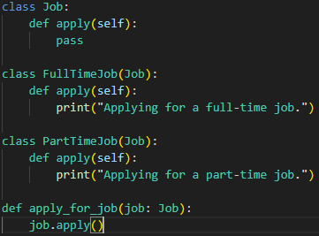

# 1 Часть

## Диаграмма контейнеров

## Диаграмма компонентов (сервис откликов)

## Диаграмма компонентов (сервис вакансий)

API Gateway служит единой точкой входа для всех клиентских запросов (маршрутизатор). Контроллер откликов обрабатывает входящие HTTP-запросы, связанные с откликами пользователей на вакансии. Репозиторий откликов отвечает за взаимодействие с базой данных. Он выполняет операции CRUD для откликов пользователей.  Сторонний сервис уведомлений отвечает за отправку уведомлений компаниям об отклике на их вакансии.

# 2 Часть

## Диаграмма последовательностей сервиса откликов

Пользователь откликается на вакансию, тем самым передавая запрос к маршрутизатору. Он в свою очередь передаёт запрос контроллеру откликов, который его обрабатывает и обращаются к репозиторию откликов. Он отсылает запрос к БД, получает ответ от неё с необходимыми данными. Полученные данные (информацию для обработки запроса) передаёт обратно в контроллер. Контроллер откликов вызывает сторонний сервис уведомлений. Сервис отправляет подтверждение обратно в API Gateway, который возвращает ответ пользователю.

# 3 Часть

## Диаграмма классов UML (модель базы банных)

### Отношения между классами
- Один пользователь может подать несколько откликов на ваканси.   
- Одна вакансия может получать несколько откликов.  
- Одна компания может публиковать несколько вакансий.  
- Один пользователь может давать несколько откликов.  
- Одна компания может давать несколько откликов.  
- Одна роль может быть у нескольких пользователей.  

У некоторых сущностей есть методы классов (к примеру: "void createJob()" у "Company", который предназначен для создания новой вакансии).

# 4 Часть

**Принцип KISS:** метод "register" в классе "User" (пользователи) выполняет одну единственную задачу и отвечает за регистрацию юзера.  
**Принцип YAGNI:** в классе "User"  метод "register" реализует только необходимую логику для создания уникального пользователя, избегая излишних действий и сложности.

**Принцип DRY:** у нас есть несколько классов, которые требуют валидации email (при регистрации пользователя и при изменении данных администратором), поэтому логика валидации вынесена в отдельную функцию.

**Принцип SOLID:**

1. *Single Responsibility Principle (SRP)* (класс должен выполнять только одну задачу) 

Класс User Repository отвечает только за операции с базой данных, связанные с пользователями.

2. *Open/Closed Principle (OCP)*  (классы должны быть открыты для расширения, но закрыты для модификации)

Сделал для примера (не используется, поскольку подобного функционала не будет, тажке нет необходимости в наследовании):  создание подклассов для "Job": "RemoteJob", который не изменяет основной класс "Job".

3. *Liskov Substitution Principle (LSP)* (объекты подклассов должны быть взаимозаменяемыми с объектами суперкласса без изменения желаемых свойств программы)  

Классы "FullTimeJob" и "PartTimeJob" могут быть использованы в любом месте, где ожидается объект типа "Job", что позволяет легко добавлять новые вакансии.

4. *Interface Segregation Principle (ISP)* (клиенты не должны зависеть от интерфейсов, которые они не используют)  

Принцип разделения интерфейсов: юзеры не должны зависеть от интерфейсов, которые они не используют.
Пример: отдельные интерфейсы для различных типов уведомлений, чтобы пользователи могли реализовывать только те методы, которые им нужны.

5. *Dependency Inversion Principle (DIP)* (высокоуровневые модули не должны зависеть от низкоуровневых. Оба должны зависеть от абстракций)  

Класс, который управляет вакансиями не зависет от конкретных реализаций модулей-классов, которые обрабатывают публикацию вакансий или отправляют уведомления.

