# Проектирование и разработка REST API
## Цель работы: получить опыт проектирования программного интерфейса

### Формулировка задания:
**Зафиксировать принятые проектные решения (не менее 8) при проектировании API (оформить в виде документации с четким и подробным описанием в виде документа в md-формате). Использовать методы: GET, POST, PUT, DELETE.
(4 балла). Реализовать соответствующий API (c методами GET, POST). Количество методов не менее 6 (2 балла). Протестировать API при помощи Postman (дополнить отчетный документ из п.1 результатами тестирования, сопроводив принтскринами из Postman). Минимум 2 теста на каждый Endpoint (2 балла). + дополнительное задание (2 метода "put" и 2 метода "delete", описанные ранее)**  
  
#### Реализованные запросы:

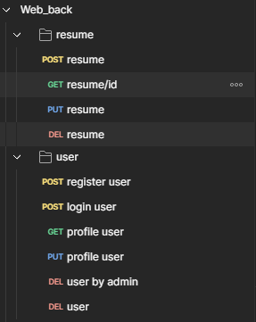

#### Пользователи системы:
В ходе проектирования REST API для системы по подбору вакансий подросткам и обсуждения предлагаемых решений с научным руководителем и компанией было принято решение о хранение пользователей внутри базы данных. Кроме того, в системе будет сразу 2 роли стейкхолдера (Пользователь и Администратор) в 1 сущности **"user"**.  
  
1.1   
**Метод:** POST  
**Доступ:** Все пользователи.  
**Описание:** Зарегистрировать пользователя в системе с ролью "Пользователь".  
**Endpoint:** http://localhost:8080/api/auth/register  
**Параметры запроса:** Обязательные поля ввода: login (логин), password (пароль).  
**Статус-коды HTTP:**  
• 200 Created: Успешно добавлено.  
• 400 Bad Request: Ошибка в запросе клиента.   
• 500 Internal Server Error: Ошибка на стороне сервера.  
**Формат ответа:**  
• Json-объект (с информацией о статусе и полученным токеном при успешном создании).   
• Json-объект (обработанная ошибка: статус и сообщение ошибки).  
**Пример запроса:**  

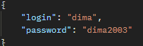  

**Пример ответа:**  

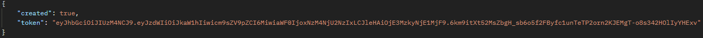

**Реализация метода:**  

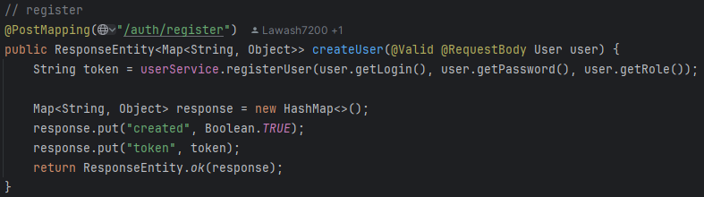  

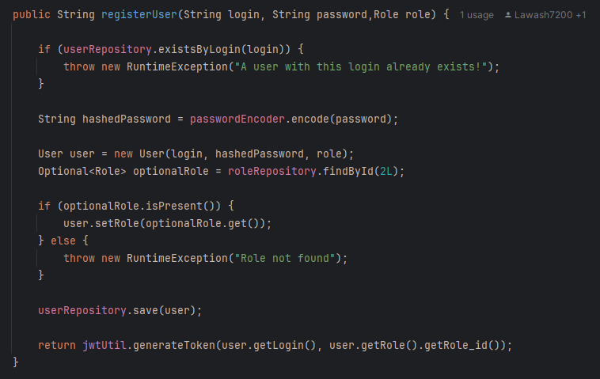
  
**Тестирование:**  

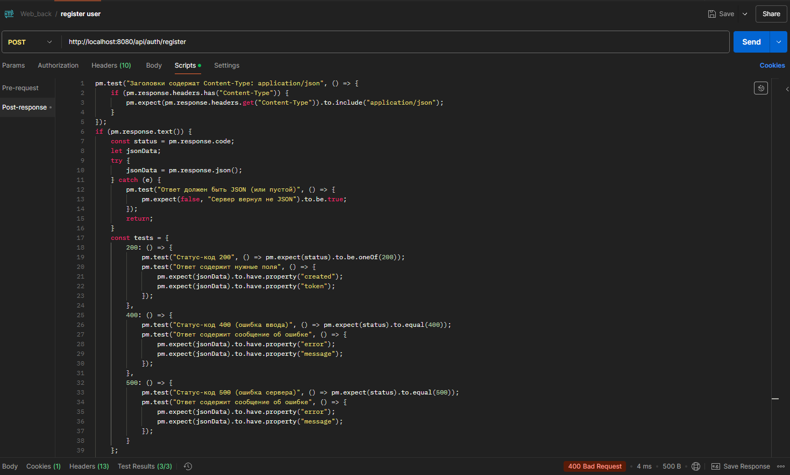  

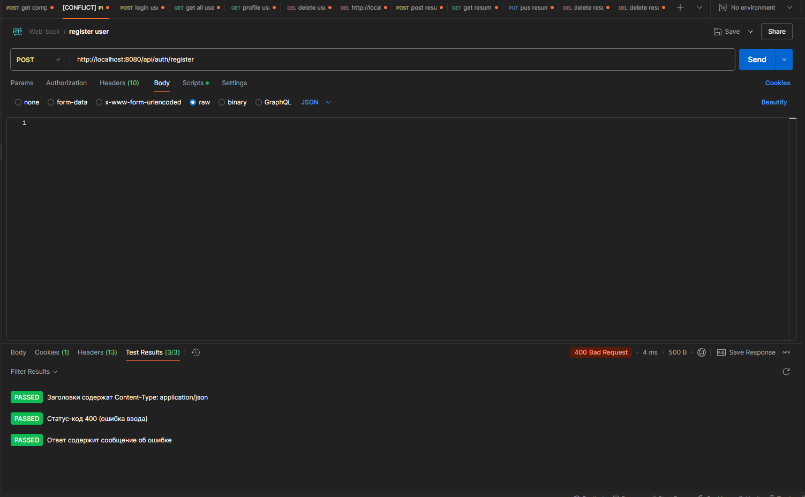

1.2  
**Метод:** POST  
**Доступ:** Все пользователи.  
**Описание:** Войти в систему под своим аккаунтом.  
**Endpoint:** http://localhost:8080/api/auth/login  
**Параметры запроса:** Обязательные поля ввода: login (логин), password (пароль).   
**Статус-коды HTTP:**  
• 200 Created: Ресурс был успешно создан.  
• 400 Bad Request: Ошибка в запросе клиента.   
• 401 Unauthorized: Ошибка авторизации.   
• 500 Internal Server Error: Ошибка на стороне сервера.  
**Формат ответа:**  
• Json-объект (с информацией о статусе и полученном токеном).  
• Json-объект (обработанная ошибка: пользователь не найден).  
**Пример запроса:**  

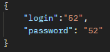  

**Пример ответа:**  

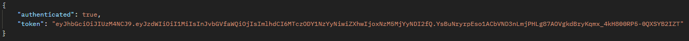  

**Реализация метода:**  

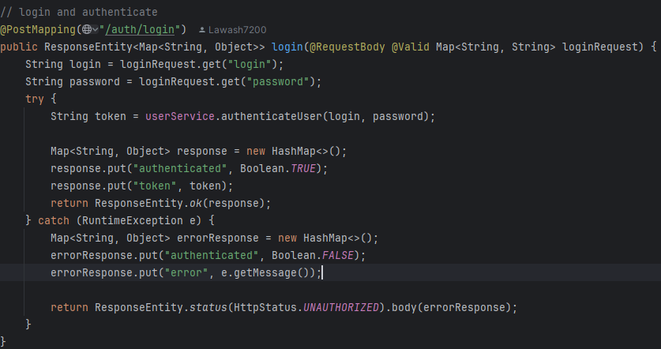

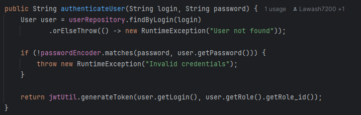

**Тестирование:**  

  

  

1.3  
**Метод:** GET  
**Доступ:** Все аутентифицированные пользователи.   
**Описание:** Получить информацию о профиле пользователя.   
**Endpoint:** http://localhost:8080/api/profile/{id}   
**Параметры запроса:** -      
**Статус-коды HTTP:**  
• 200 Created: Ресурс был успешно создан.  
• 400 Bad Request: Ошибка в запросе клиента.   
• 401 Unauthorized: Ошибка авторизации.   
• 404 Not Found: Запрашиваемый ресурс не найден.   
• 500 Internal Server Error: Ошибка на стороне сервера.  
**Формат ответа:**      
• Json-объект (с информацией о пользователе).  
• Json-объект (обработанная ошибка: необходимость аутентификации \ статус: нет доступа).  
**Пример запроса:**  
• Любое тело запроса (или его отсутствие).  
**Пример ответа:**  

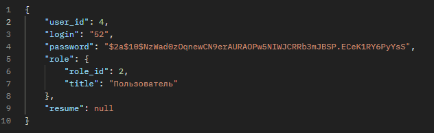  

**Реализация метода:**  

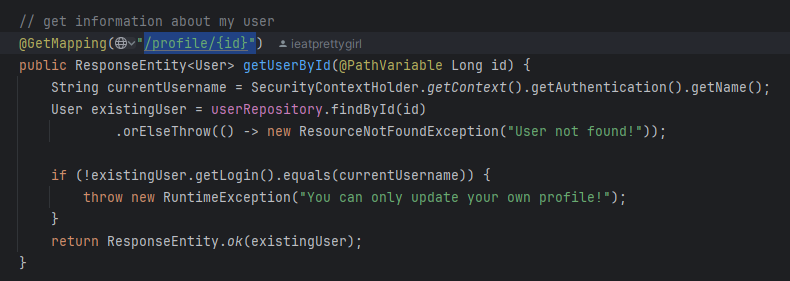  

**Тестирование:**  

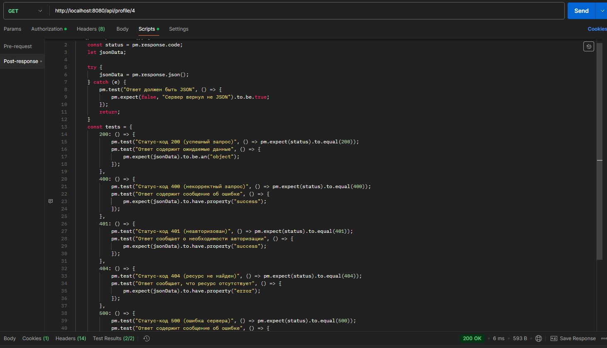  

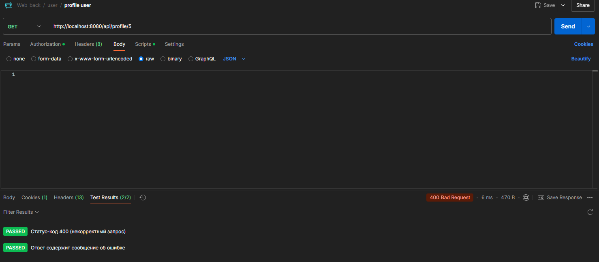

1.4  
**Метод:** PUT   
**Доступ:** Все аутентифицированные пользователи.  
**Описание:** Изменить информацию о профиле пользователя.  
**Endpoint:** http://localhost:8080/api/profile/{id}  
**Параметры запроса:** login, password.     
**Статус-коды HTTP:**  
• 200 OK: Запрос успешно выполнен.  
• 400 Bad Request: Ошибка в запросе клиента.  
• 401 Unauthorized: Необходима аутентификация.   
• 404 Not Found: Запрашиваемый ресурс не найден.   
• 500 Internal Server Error: Ошибка на стороне сервера.  
**Формат ответа:**      
• Json-объект (обновлённая информация и новый сгенерированный токен).  
• Json-объект (обработанная ошика: информация о статусе и ошибке).  
**Пример запроса:**  
• Любое тело запроса (или его отсутствие).  
**Пример ответа:**  

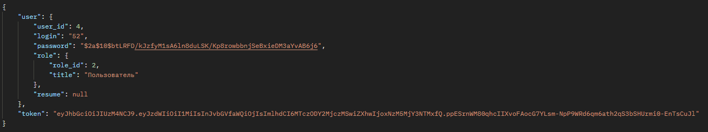  

**Реализация метода:**  

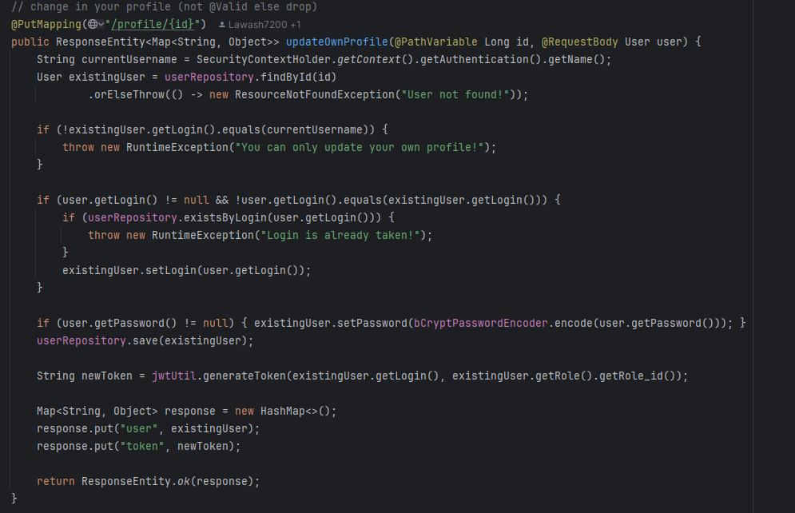  

**Тестирование:**  

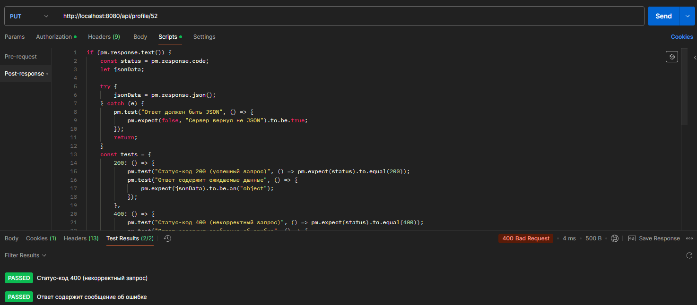

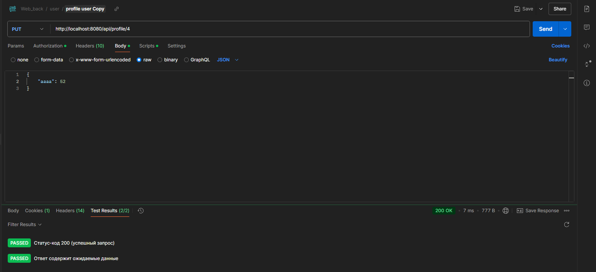

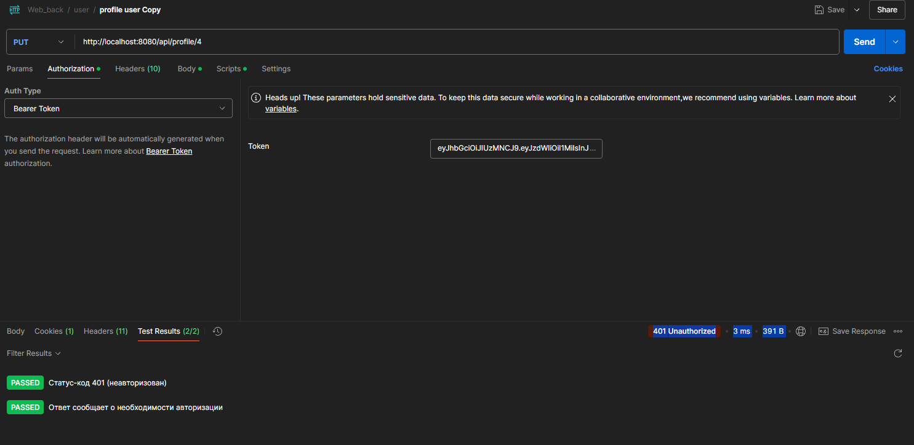

1.5  
**Метод:** DELETE  
**Доступ:** Аутентифицированный пользователь с ролью "Администратор".  
**Описание:** Удалить пользователя из системы.    
**Endpoint:** http://localhost:8080/api/user/{id}   
**Параметры запроса:** -       
**Статус-коды HTTP:**  
• 200 OK: Запрос успешно выполнен, и данные были обновлены.  
• 400 Bad Request: Ошибка в запросе клиента.   
• 401 Unauthorized: Необходима аутентификация.  
• 404 Not Found: Запрашиваемый ресурс не найден.  
• 500 Internal Server Error: Ошибка на стороне сервера.  
**Формат ответа:**      
• Json-объект (сообщение об успешном удалении).  
• Json-объект (обработанная ошика: информация о статусе и ошибке).  
**Пример запроса:**  
• Любое тело запроса (или его отсутствие).  
**Пример ответа:**  

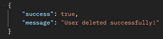

**Реализация метода:**  

  

**Тестирование:**  

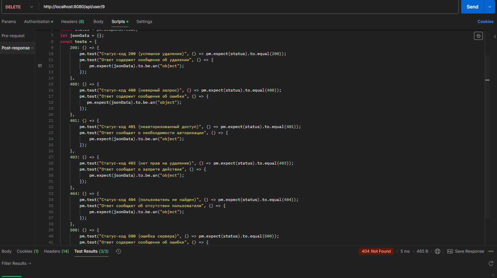

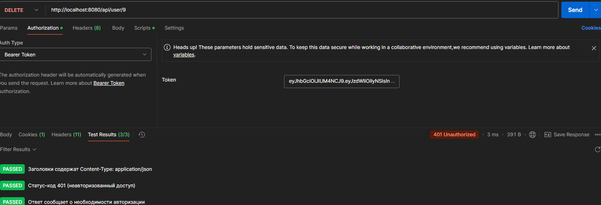

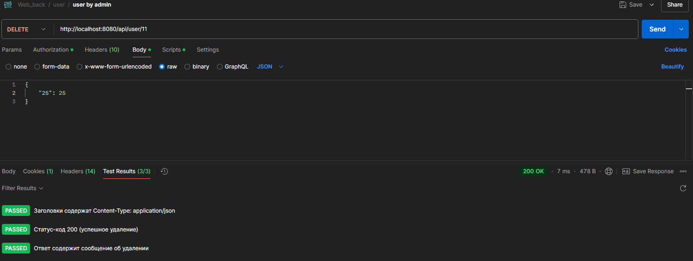

1.6  
**Метод:** DELETE    
**Доступ:** Все аутентифицированные пользователи.     
**Описание:** Удалить свой профиль (аккаунт).  
**Endpoint:** http://localhost:8080/api/profile/{id}  
**Параметры запроса:** -        
**Статус-коды HTTP:**  
• 200 OK: Запрос успешно выполнен, пользователь удалён.  
• 400 Bad Request: Ошибка в запросе клиента.  
• 401 Unauthorized: Необходима аутентификация.  
• 404 Not Found: Запрашиваемый ресурс не найден.   
• 500 Internal Server Error: Ошибка на стороне сервера.  
**Формат ответа:**    
• Json-объект (сообщение об успешном удалении и разлогирование).  
• Json-объект (обработанная ошика: информация о статусе и ошибке).  
**Пример запроса:**  
• Любое тело запроса (или его отсутствие).  
**Пример ответа:**  

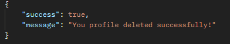

**Реализация метода:**  

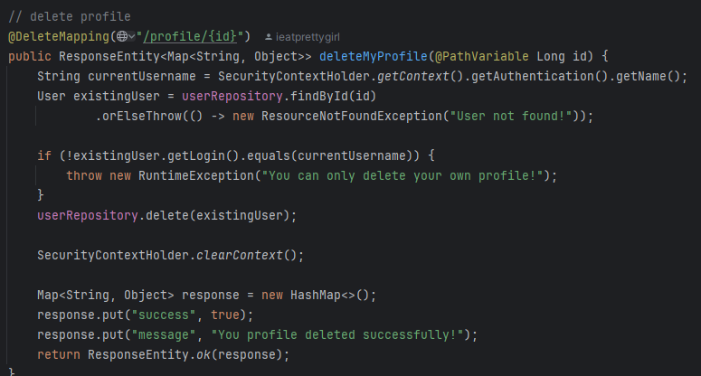

**Тестирование:**  

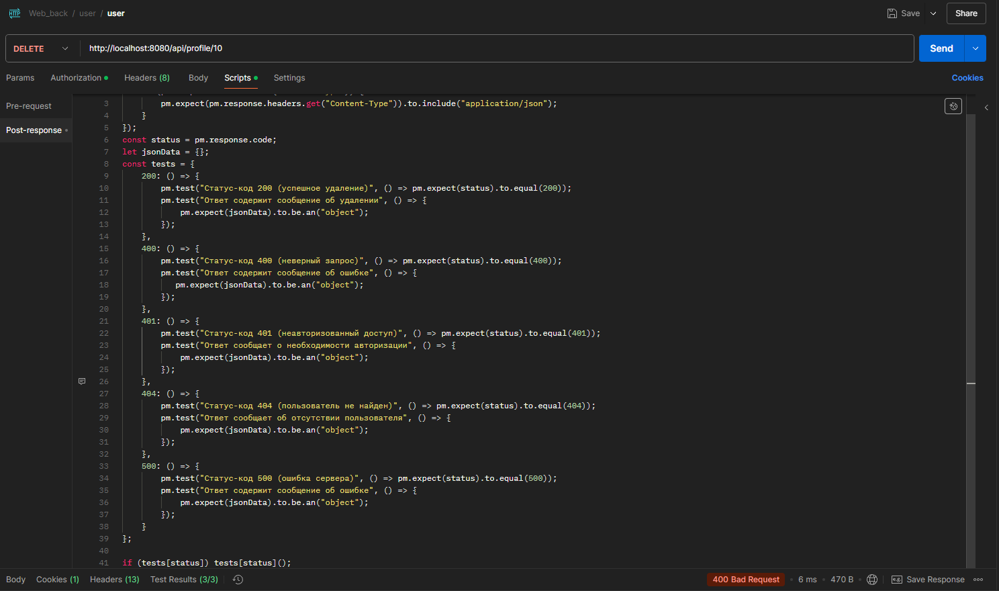

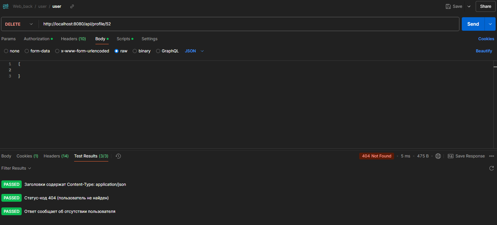

#### Резюме:
Также в системе каждый пользователь может иметь резюме, хранящееся в сущности БД: **"resume"**. Каждый пользователь может иметь лишь 1 резюме (связь 1 К 1).

1.7  
**Метод:** POST  
**Доступ:** Все аутентифицированные пользователи.      
**Описание:** Создать резюме.  
**Endpoint:** http://localhost:8080/api/resume  
**Параметры запроса:** education (об-ние), skills (навыки), birthday (дата рождения), full_name(ФИО), contact (контактная почта).  
**Статус-коды HTTP:**  
• 200 OK: Запрос успешно выполнен.   
• 400 Bad Request: Ошибка в запросе клиента.  
• 401 Unauthorized: Необходима аутентификация.  
• 404 Not Found: Запрашиваемый ресурс не найден.   
• 500 Internal Server Error: Ошибка на стороне сервера.  
**Формат ответа:**      
• Json-объект (с информацией об успешном создании).   
• Json-объект (обработанная ошибка: статус и сообщение ошибки).  
**Пример запроса:**  

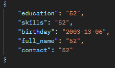

**Пример ответа:**  

**Реализация метода:**  

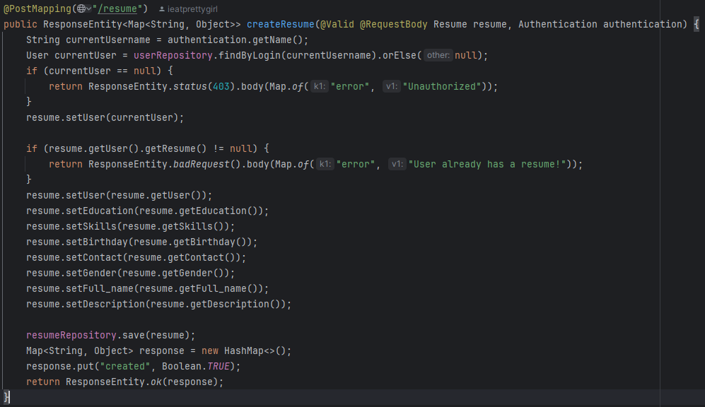

**Тестирование:**  

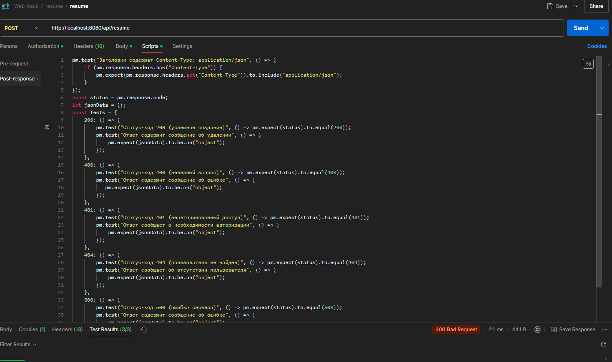

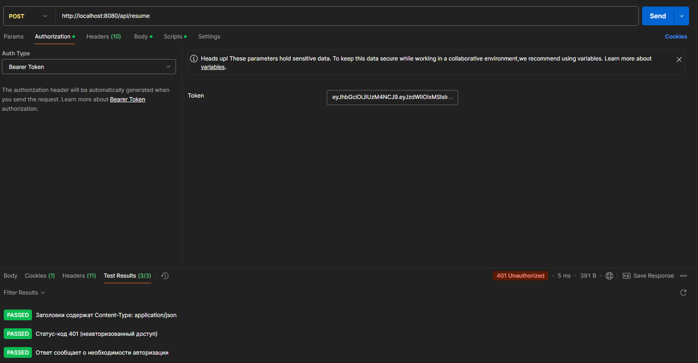

1.8  
**Метод:** GET  
**Доступ:** Все аутентифицированные пользователи.     
**Описание:** Получить информацию о своё резюме.  
**Endpoint:** http://localhost:8080/api/resume/{id}  
**Параметры запроса:** -    
**Статус-коды HTTP:**  
• 200 Created: Ресурс был успешно создан.  
• 400 Bad Request: Ошибка в запросе клиента.   
• 401 Unauthorized: Ошибка авторизации.   
• 404 Not Found: Запрашиваемый ресурс не найден.   
• 500 Internal Server Error: Ошибка на стороне сервера.  
**Формат ответа:**      
• Json-объект (с полной информацией об объекте).   
• Json-объект (обработанная ошибка: статус и сообщение ошибки).  
**Пример запроса:**  
• Любое тело запроса (или его отсутствие).  
**Пример ответа:**  

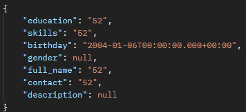

**Реализация метода:**  

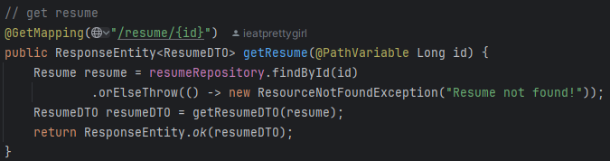

**Тестирование:**  

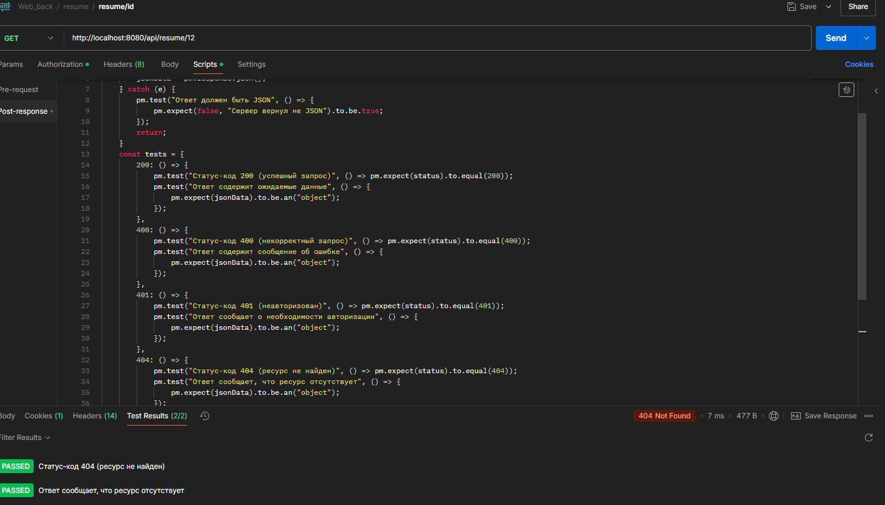

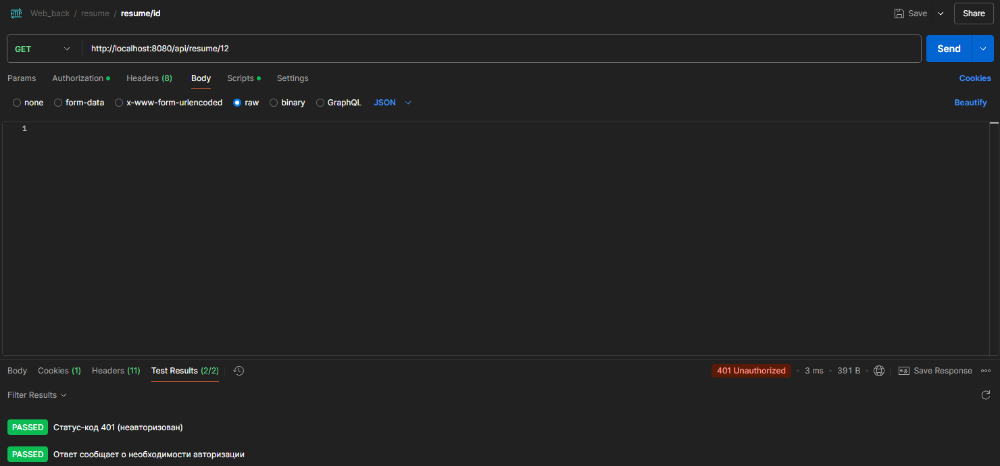

1.9  
**Метод:** PUT  
**Доступ:** Все аутентифицированные пользователи.     
**Описание:** Обновить информацию о своём резюме.  
**Endpoint:** http://localhost:8080/api/resume/{id}   
**Параметры запроса:** education (об-ние), skills (навыки), birthday (дата рождения), full_name(ФИО), contact (контактная почта).    
**Статус-коды HTTP:**  
• 200 Created: Ресурс был успешно создан.  
• 400 Bad Request: Ошибка в запросе клиента.   
• 401 Unauthorized: Ошибка авторизации.   
• 404 Not Found: Запрашиваемый ресурс не найден.   
• 500 Internal Server Error: Ошибка на стороне сервера.  
**Формат ответа:**      
• Json-объект (обновлённая информация (статус), объект).  
• Json-объект (обработанная ошибка: статус и сообщение ошибки).  
**Пример запроса:**  

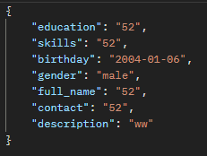

**Пример ответа:**  

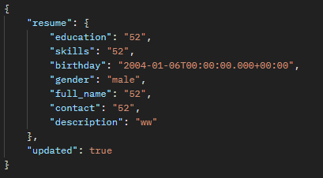

**Реализация метода:**  

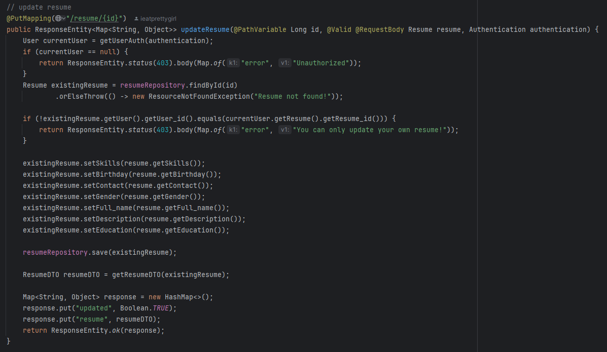

**Тестирование:**  

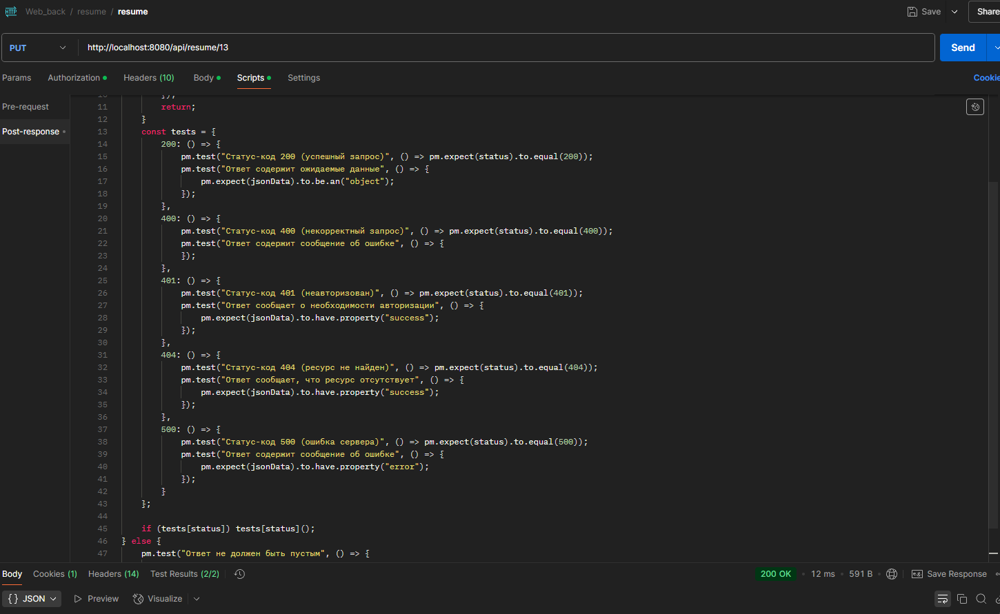

1.10  
**Метод:** DELETE  
**Доступ:** Все аутентифицированные пользователи.     
**Описание:** Удалить своё резюме.  
**Endpoint:** http://localhost:8080/api/resume/{id}  
**Параметры запроса:** -     
**Статус-коды HTTP:**  
• 200 OK: Запрос успешно выполнен, компания удалена.  
• 400 Bad Request: Ошибка в запросе клиента.   
• 401 Unauthorized: Необходима аутентификация.  
• 404 Not Found: Запрашиваемый ресурс не найден.   
• 500 Internal Server Error: Ошибка на стороне сервера.  
**Формат ответа:**      
• Json-объект (с объектом, статусом об успешном удалении).  
• Json-объект (обработанная ошибка: статус и сообщение ошибки).  
**Пример запроса:**  
• Любое тело запроса (или его отсутствие).  
**Пример ответа:**  

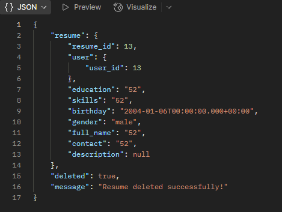

**Реализация метода:**  

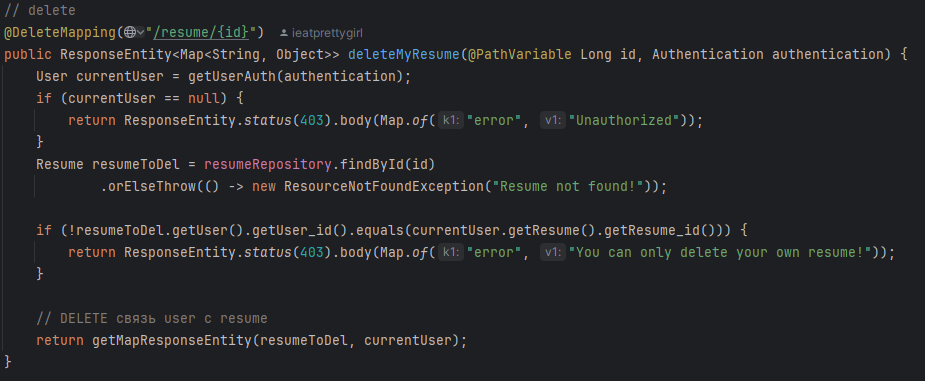

**Тестирование:**  

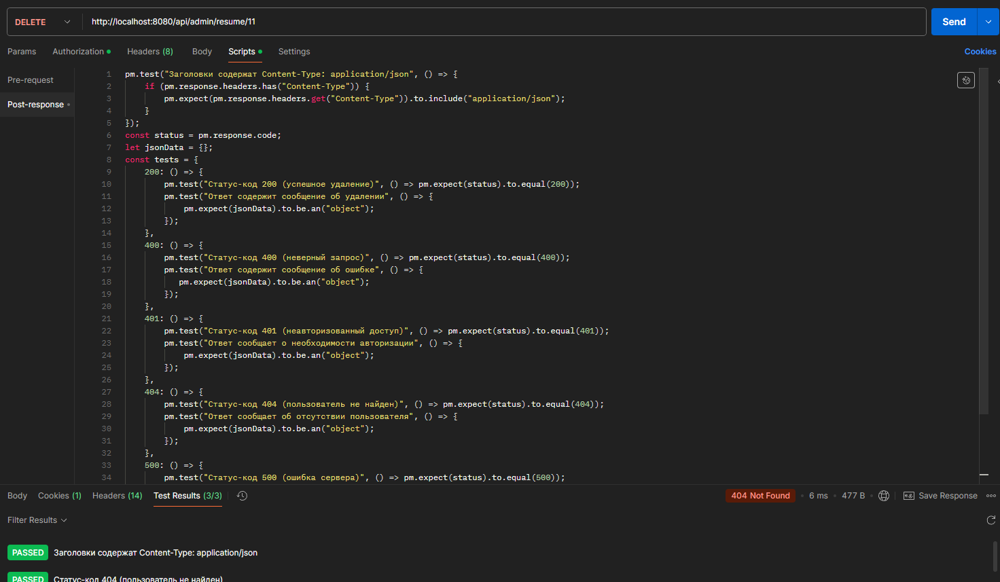

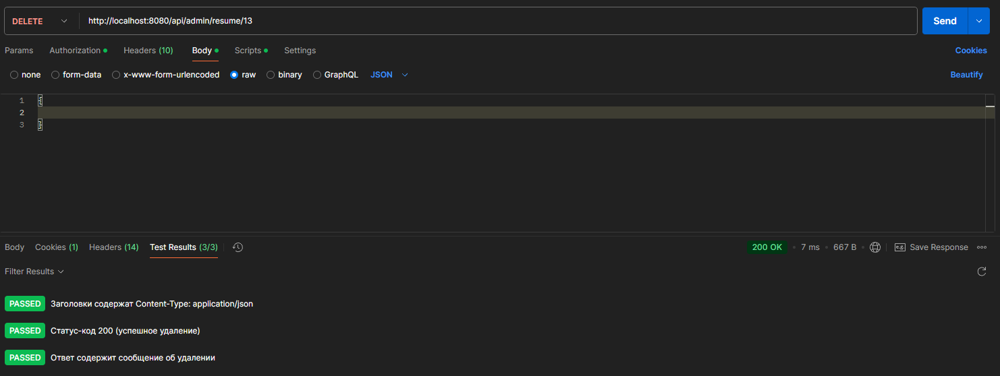
