# Использование шаблонов проектирования
### Цель работы: получить опыт применения шаблонов проектирования при написании кода программной системы.

### Формулировка задания:
Применить типовые шаблоны проектирования GoF (Gang of Four) для своего проекта. Продемонстрировать результаты в виде конечного кода и UML-диаграмм.  
- Порождающие шаблоны - 3 шт.  
- Структурные шаблоны - 4 шт.  
- Поведенческие шаблоны - 5 шт.  

## Использование Порождающих паттернов
**Порождающие паттерны** — это паттерны, которые абстрагируют процесс инстанцирования или, иными словами, процесс порождения классов и объектов.  

### 1. Фабричный метод (Factory Method)

***Назначение***: определяет интерфейс для создания объекта, но оставляет подклассам решение о том, какой класс инстанцировать. Фабричный метод позволяет классу делегировать инстанцирование подклассам.

Следует использовать:
- Когда заранее неизвестно, объекты каких типов необходимо создавать.
- Когда система должна быть независимой от процесса создания новых объектов и расширяемой: в нее можно легко вводить новые классы, объекты которых система должна создавать.
- Когда создание новых объектов необходимо делегировать из базового класса классам наследникам.

***Комментарий***: контроллер вызывает метод describeJob, передавая тип вакансии (fulltime или parttime). Сервис использует фабрику (ConcreteJobFactory) для создания конкретной вакансии. Фабрика возвращает нужную вакансию в зависимости от переданного типа. Сервис вызывает метод describe() у созданной вакансии.

***Пример реализации***:  

Фабрика JobFactory:

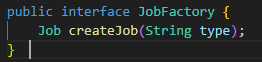

Реализация компонента:

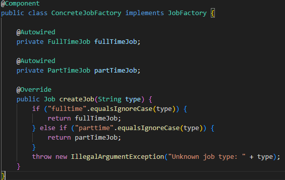

Использование фабрики в сервисе:

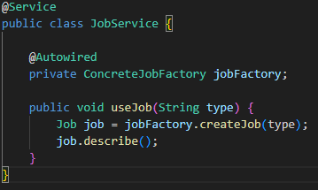

Диаграмма-UML реализации шаблона: 

### 2. Прототип (Prototype)

***Назначение***: позволяет создавать новые объекты путем клонирования уже существующих. По сути данный паттерн предлагает технику клонирования объектов.

Следует использовать:

- Класс порождаемого объекта определяется в момент выполнения.
- Когда желательно избежать наследования создателя объекта.
- Когда клонирование объекта является более предпочтительным вариантом нежели его создание и инициализация с помощью конструктора.
- Когда создание копии объекта проще и быстрее, чем порождение его стандартным путем, используя операцию new и включая инициализацию полей.

***Комментарий***: интерфейс определяет метод clone(), который возвращает копию объекта, наследуя Cloneable.Класс реализует метод clone(), используя встроенный механизм клонирования Java (super.clone()). Создается и клонируется объект-прототип (fullTimeJob).

***Пример реализации***:  

Класс + интерфейс:

Использование прототипа:

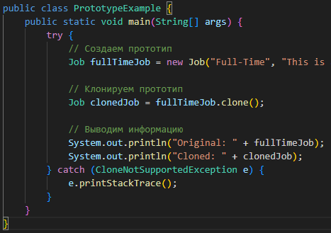

Диаграмма-UML реализации шаблона: 

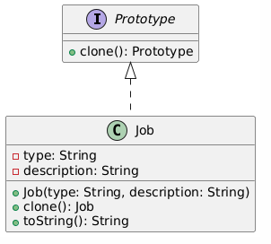

### 3. Синглтон (Singleton)

***Назначение***: гарантирует, что у класса есть только один экземпляр, и предоставляет глобальную точку доступа к нему.

Практически в любом приложении возникает необходимость в глобальных переменных или объектах с ограниченным числом экземпляров. Самый простой способ решить эту задачу — создать глобальный объект, который будет доступен из любой точки приложения. По своему определению синглтон гарантирует, что у некоего класса есть лишь один экземпляр. В некоторых случаях анализ предметной области строго требует, чтобы класс существовал лишь в одном экземпляре. Однако на практике паттерн «Синглтон» обычно используется для обеспечения доступа к какому-либо ресурсу, который требуется разным частям приложения, например к бд.

***Комментарий***: храним единственный экземпляр класса DatabaseConnection.

***Пример реализации***: 

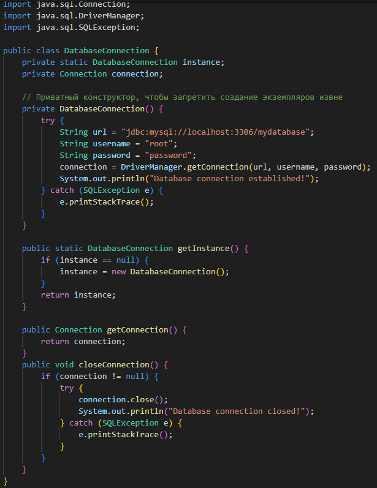

Диаграмма-UML реализации шаблона: 

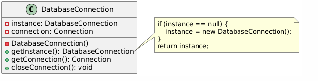

## Использование Структурных паттернов

**Структурные паттерны** - рассматривает, как классы и объекты образуют более крупные структуры - более сложные по характеру классы и объекты.

### 1. Компоновщик (Composite)

***Назначение***: компонует объекты в древовидные структуры для представления иерархий «часть — целое». Позволяет клиентам единообразно трактовать индивидуальные и составные объекты. Реализацию паттерна можно представить в виде меню, которое имеет различные пункты. Эти пункты могут содержать подменю, в которых, в свою очередь, также имеются пункты.

Следует использовать:

- Когда объекты должны быть реализованы в виде иерархической древовидной структуры.
- Когда клиенты единообразно должны управлять как целыми объектами, так и их составными частями. То есть целое и его части должны реализовать один и тот же интерфейс.

***Комментарий***: создаем конкретную вакансию, которая не может содержать другие компоненты. Создаем группу вакансий, которая может содержать как отдельные вакансии, так и другие группы. Создаем иерархию вакансий и групп.

***Пример реализации***: 

Job (Конкретная вакансия):

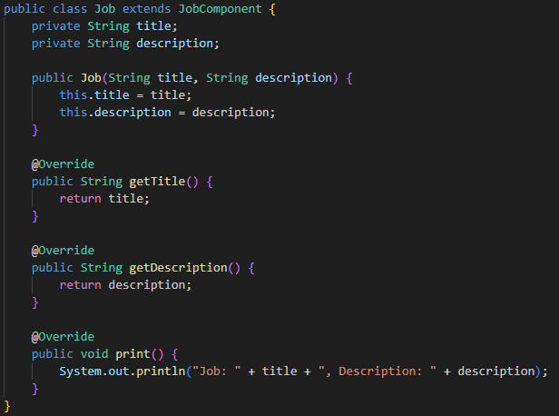

 Композит JobGroup (Группа вакансий):

 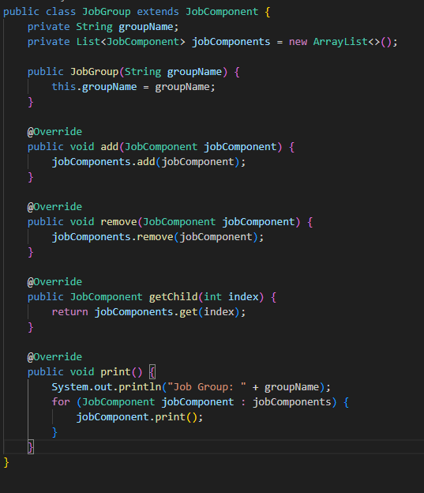

Использование паттерна:

 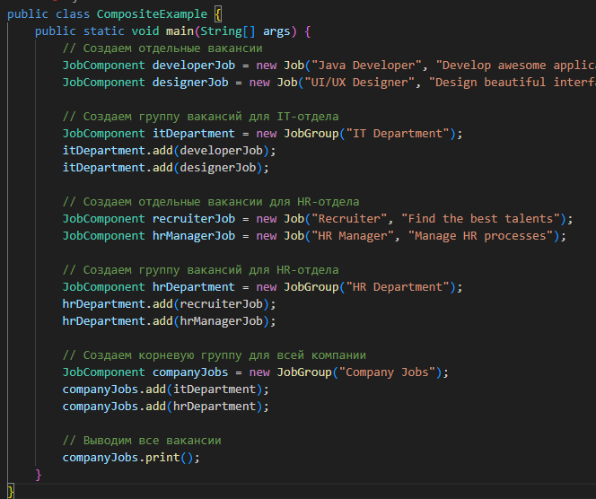

Диаграмма-UML реализации шаблона:

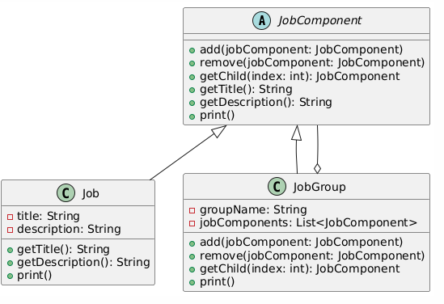

### 2. Декоратор (Decorator)

***Назначение***: динамически добавляет объекту новые обязанности. Является гибкой альтернативой порождению подклассов с целью расширения функциональности.

Следует использовать:
- Когда надо динамически добавлять к объекту новые функциональные возможности.
- Когда применение наследования неприемлемо. Например, если нам надо определить множество различных функциональностей и для каждой функциональности наследовать отдельный класс, то структура классов может очень сильно разрастись.

***Комментарий***: реализует базовое уведомление (например, Email). Содержит ссылку на объект Notification. Реализует тот же интерфейс, что и базовый компонент. Добавляют новую функциональность.

***Пример реализации*** (уместил пример в 1 скриншот): 

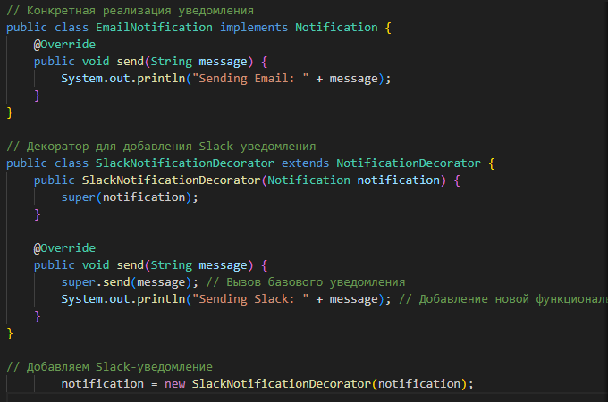

Диаграмма-UML реализации шаблона:

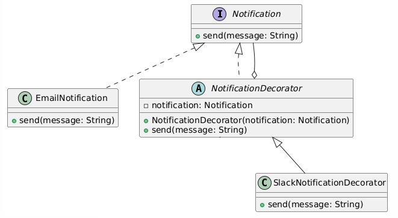

### 3. Фасад (Facade)

***Назначение***: предоставляет унифицированный интерфейс вместо набора интерфейсов некоторой подсистемы. Фасад определяет интерфейс более высокого уровня, который упрощает использование подсистемы.  
Шаблон Фасад объединяет группу объектов в рамках одного специализированного интерфейса и переадресует вызовы его методов к этим объектам.

Следует использовать:
- Когда имеется сложная система, и необходимо упростить с ней работу. Фасад позволит определить одну точку взаимодействия между клиентом и системой.
- Когда надо уменьшить количество зависимостей между клиентом и сложной системой. Фасадные объекты позволяют отделить, изолировать компоненты системы от клиента и развивать и работать с ними независимо.
- Когда нужно определить подсистемы компонентов в сложной системе. Создание фасадов для компонентов каждой отдельной подсистемы позволит упростить взаимодействие между ними и повысить их независимость друг от друга.

***Комментарий***: Фасад (CompanyFacade) предоставляет простой интерфейс для выполнения сложных операций внутри программы.

Скрывает сложность взаимодействия с подсистемами.

***Пример реализации*** (уместил пример в 1 скриншот): 

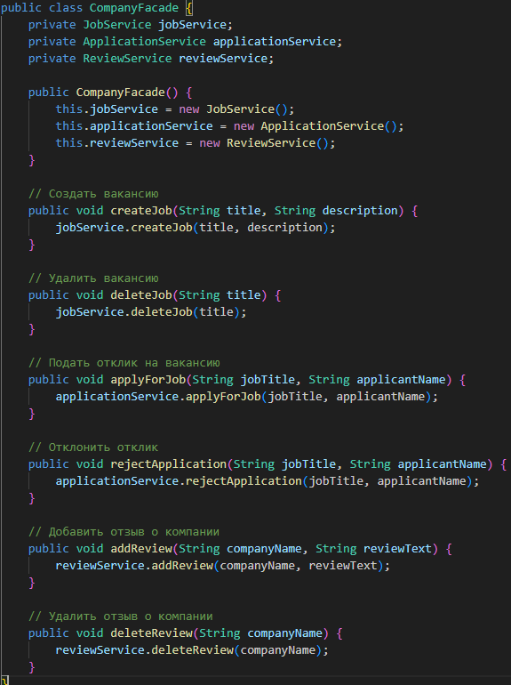

Диаграмма-UML реализации шаблона (**показывает взаимодействие сервисов**):

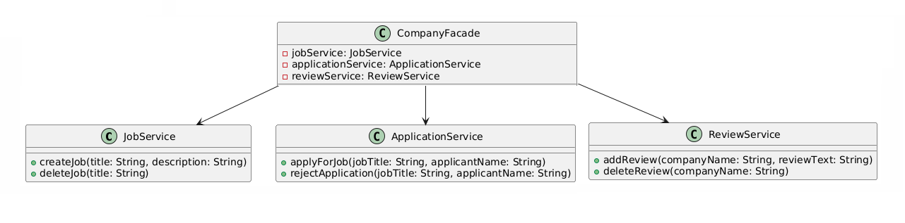

### 4. Заместитель (Proxy)

***Назначение***: заменение требований и эволюция системы могут вызвать необходимость внесения серьезных архитектурных изменений. Если на ранних этапах некая операция выполнялась на стороне клиента или же приложение состояло из одного процесса, то со временем исполнение операции может быть перенесено на сервер, а приложение разбито на несколько процессов. В результате возникает задача взаимодействия с удаленным процессом, реализация которой должна быть максимально похожей на локальное взаимодействие.  
Proxy (заместитель)  — ​ является суррогатом другого объекта и контролирует доступ к нему.​

Следует использовать в следующих случаях:
- Удаленный заместитель (remote proxies) — ​отвечает за кодирование запроса и его аргументов для работы с компонентом в другом адресном пространстве.
- Виртуальный заместитель (virtual proxies) —​ может кэшировать дополнительную информацию о реальном компоненте, чтобы отложить его создание.
- Защищающий заместитель (protection proxies) — проверяет, имеет ли вызывающий объект необходимые для выполнения запроса права.​ 

***Комментарий***: создаем JobProxy (наследует Job), который контролирует доступ к реальному объекту.Откладывает создание реального объекта до момента его фактического использования (ленивая инициализация).

***Пример реализации***: 

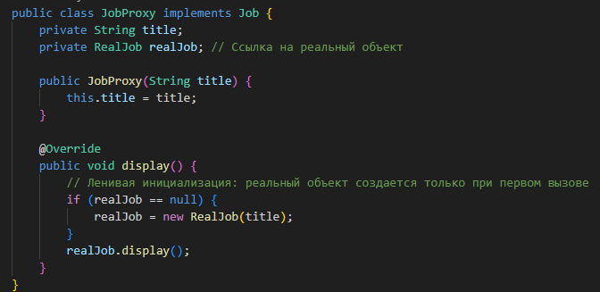

Диаграмма-UML реализации шаблона:

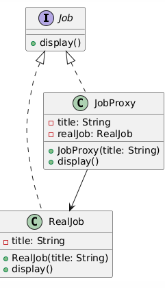

## Использование Поведенческих паттернов

**Поведенческие паттерны** - они определяют алгоритмы и взаимодействие между классами и объектами, то есть их поведение.

### 1. Команда (Command)

***Назначение***: инкапсулирует запрос как объект, позволяя тем самым задавать параметры клиентов для обработки соответствующих запросов, ставить запросы в очередь или протоколировать их, а также поддерживать отмену операций.
Паттерн  позволяет спрятать действие в объекте и отвязать источник этого действия от места его исполнения. Классический пример — проектирование пользовательского интерфейса.

Следует использовать:

- Когда необходимо обеспечить выполнение очереди запросов, а также их возможную отмену.
- Когда надо поддерживать логгирование изменений в результате запросов. Использование логов может помочь восстановить состояние системы - для этого необходимо будет использовать последовательность запротоколированных команд.
- Когда необходимо параметризировать объекты выполняемым действием, ставить запросы в очередь или поддерживать операции отмены (undo) и повтора (redo) действий.

***Комментарий***: PublishJobCommand и DeleteJobCommand инкапсулируют запросы на публикацию и удаление вакансий. JobService выполняет фактическую работу (публикация и удаление вакансий). JobInvoker вызывает команды, не зная их деталей.

***Пример реализации***: 

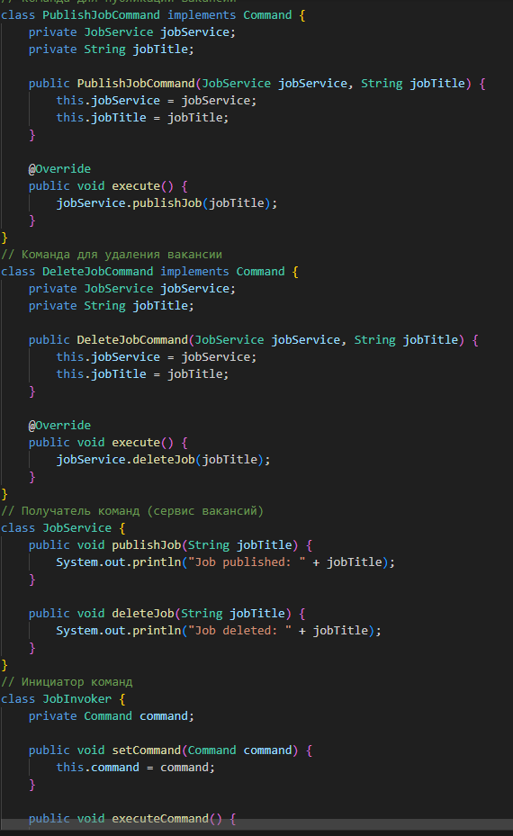

Диаграмма-UML реализации шаблона:

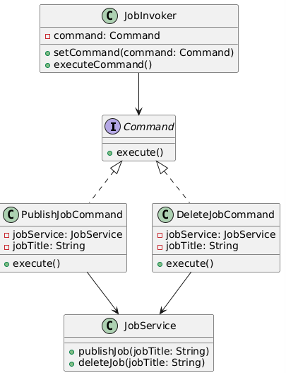

### 2. Посредник (Mediator)

***Назначение***: обеспечивает взаимодействие множества объектов без необходимости ссылаться друг на друга. Тем самым достигается слабосвязанность взаимодействующих объектов.

Следует использовать:

- Когда имеется множество взаимосвязаных объектов, связи между которыми сложны и запутаны.
- Когда необходимо повторно использовать объект, однако повторное использование затруднено в силу сильных связей с другими объектами.

***Комментарий***: посредник (JobMediator) управляет взаимодействием между компонентами: пересылает сообщения от одного компонента другим.

***Пример реализации***: 

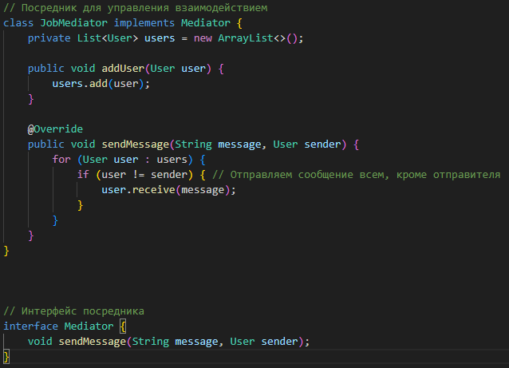

Диаграмма-UML реализации шаблона:

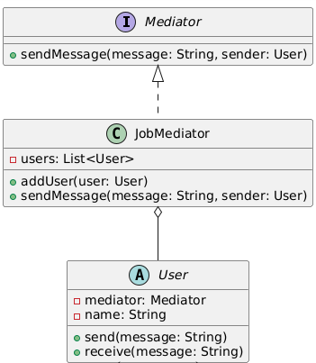

### 3. Хранитель (Memento)

***Назначение***: позволяет выносить внутреннее состояние объекта за его пределы для последующего возможного восстановления объекта без нарушения принципа инкапсуляции.

Следует использовать:
- Когда нужно сохранить состояние объекта для возможного последующего восстановления.
- Когда сохранение состояния должно проходить без нарушения принципа инкапсуляции.

***Комментарий***: класс содержит методы для состояний, класс JobMemento хранит состояния, JobHistory сохраняет состояние в виде списка.

***Пример реализации***: 

Методы: 

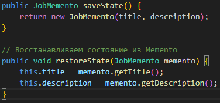

Классы:

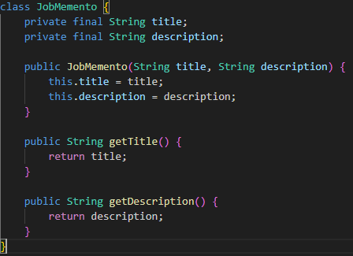

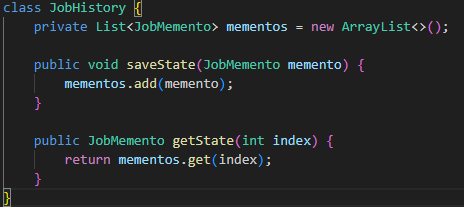

Диаграмма-UML реализации шаблона:

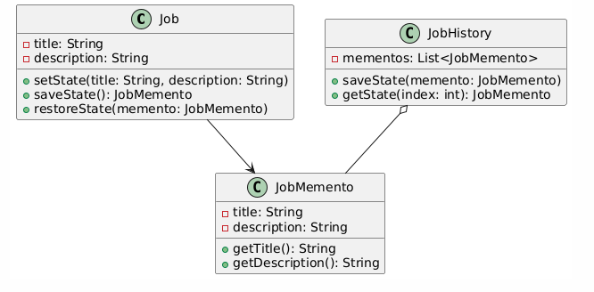

### 4. Состояние (State)

***Назначение***: позволяет объекту варьировать свое поведение в зависимости от внутреннего состояния. Извне создается впечатление, что изменился класс объекта.

Следует использовать:
- Когда поведение объекта должно зависеть от его состояния и может изменяться динамически во время выполнения.
- Когда в коде методов объекта используются многочисленные условные конструкции, выбор которых зависит от текущего состояния объекта.

***Комментарий***: интерфейс JobState определяет методы для каждого действия, которое может выполнять вакансия (publish, close, pause). Конкретные состояния (OpenState, ClosedState, PausedState) реализуют поведение вакансии в зависимости от её состояния.
Класс Job содержит ссылку на текущее состояние. Делегирует вызовы методов (publish, close, pause) текущему состоянию.

***Пример реализации***: 

Интерфейс:

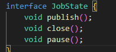

Состояния:

Диаграмма-UML реализации шаблона:

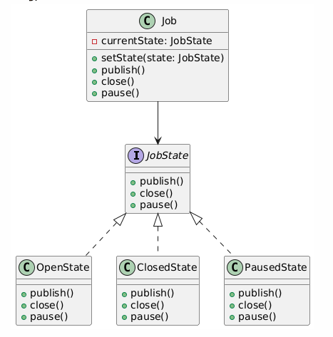

### 5. Шаблонный метод (Template Method)

***Назначение***: шаблонный метод определяет основу алгоритма и позволяет подклассам переопределять некоторые шаги алгоритма, не изменяя его структуры в целом.

Следует использовать:
- Когда планируется, что в будущем подклассы должны будут переопределять различные этапы алгоритма без изменения его структур.
- Когда в классах, реализующим схожий алгоритм, происходит дублирование кода. Вынесение общего кода в шаблонный метод уменьшит его дублирование в подклассах.

***Комментарий***: абстрактный класс JobPostingTemplate определяет шаблонный метод postJob(), который описывает общий алгоритм публикации вакансии, шаги (prepareJobDescription, validateJobDetails) оставлены для реализации подклассам.

***Пример реализации***: 

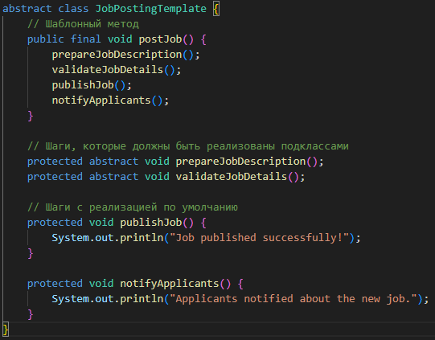

Диаграмма-UML реализации шаблона:

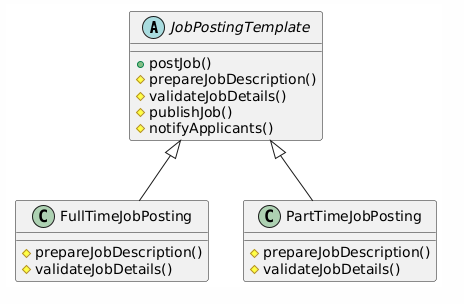